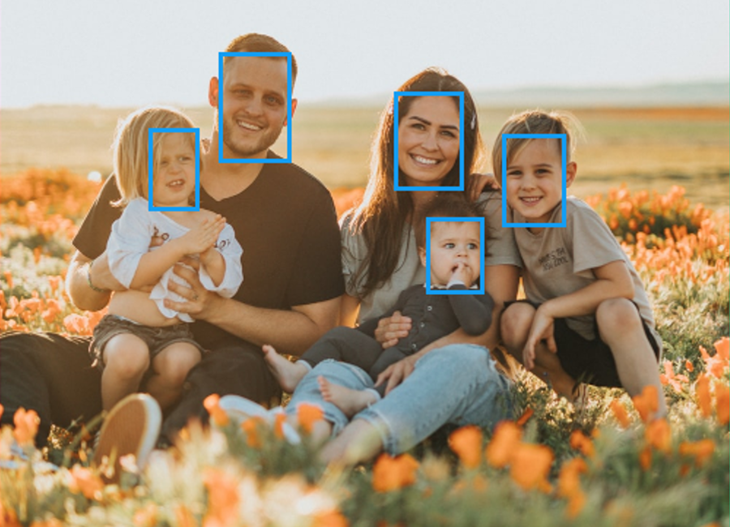

# face-boxer

A website application that leverages a 3rd party machine
learning / artificial intelligence API to detect faces in user provided images.

• JavaScript • HTML • CSS • React • Redux • Node • Express • Knex • PostgreSQL •

[Live Demo](https://face-boxer-frontend.herokuapp.com/)

_\*Heroku server may take a minute to spin up_

[Backend Source](https://github.com/tomrule007/face-boxer)
